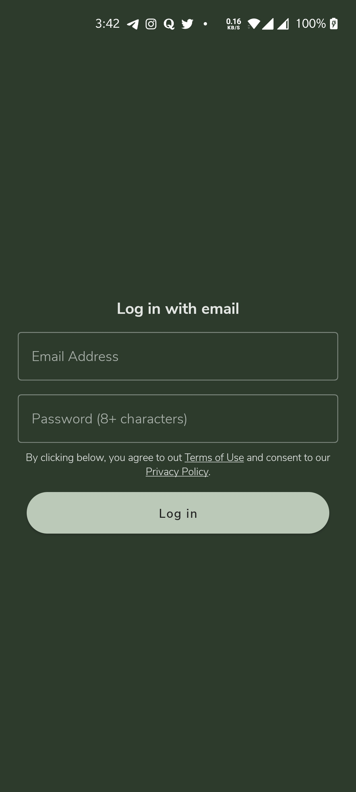

# TheBloom - AndroidDevChallenge #3

### :scroll: Description
Application build with ❤️ and 🚀 jetpack compose for Jetpack Compose #AndroidDevChallenge Week 3

### Android Developer Challeneg 2021 - Week 3

Application to participate in [Android Dev Challenege 2021 - week 3](https://android-developers.googleblog.com/2021/03/android-dev-challenge-3.html)

This contains implementation for Asia-Pacific Region Assets [here](https://github.com/android/android-dev-challenge-compose/blob/assets/Bloom.zip)


## Built With 🛠
- [Kotlin](https://kotlinlang.org/) official programming language for Android development.
- [Jetpack Compose](https://developer.android.com/jetpack/compose) Android’s modern toolkit for building native UI.


## :camera_flash: Preview
<!-- You can add more screenshots here if you like -->
&emsp;&emsp;

## :eyes: Social
[LinkedIn](https://bit.ly/ch8n-linkdIn) | [Medium](https://bit.ly/ch8n-medium-blog) | [Twitter](https://bit.ly/ch8n-twitter) | [StackOverflow](https://bit.ly/ch8n-stackOflow) | [CodeWars](https://bit.ly/ch8n-codewar) | [Portfolio](https://bit.ly/ch8n-home) | [Github](https://bit.ly/ch8n-git) | [Instagram](https://bit.ly/ch8n-insta) | [Youtube](https://bit.ly/ch8n-youtube)

## License
```
Copyright 2020 The Android Open Source Project

Licensed under the Apache License, Version 2.0 (the "License");
you may not use this file except in compliance with the License.
You may obtain a copy of the License at

    https://www.apache.org/licenses/LICENSE-2.0

Unless required by applicable law or agreed to in writing, software
distributed under the License is distributed on an "AS IS" BASIS,
WITHOUT WARRANTIES OR CONDITIONS OF ANY KIND, either express or implied.
See the License for the specific language governing permissions and
limitations under the License.
```
